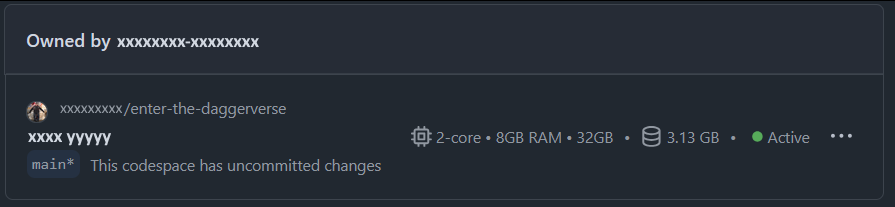

# Setup

To run this codelab, you have 2 choices:

- Use GitHub [Codespace](#codespace) by clicking on the button bellow (**recommended**)
- Install all prerequisites and Dagger on your computer (see section [Local installation](#local-installation) of this document)

## Codespace

### Repository fork

Please, fork this repository. With your fork, you can commit & push to save your work.

### Codespace creation

Click on the button bellow:

[](https://codespaces.new/jhaumont/enter-the-daggerverse)

In the codespace's creation's page, keep in mind to **change the repository name to use your fork**. To be more comfortable, select 4-core machine type:


Codespace environnement can take few minutes.

Now, you are ready to go to next page [Getting started with Dagger](02-getting-started-with-Dagger.md)

> [!TIP]
> If the code space loading page is still displayed, scroll to bottom of [Codespace page](https://github.com/codespaces/) 
> 
>
> If status is `Active`, that means the codespace is ready, but web page is blocked maybe due to too many call from same IP addresses (in case of codelab with too many people). Voir [Se connecter à VSCode (optionnel)](#se-connecter-à-vscode-optionnel).

### Connect to VSCode (optional)

You can connect your local VSCode (from your computer) directly to codespace environnement. To do that, please read [official documentation](https://docs.github.com/en/codespaces/developing-in-a-codespace/using-github-codespaces-in-visual-studio-code).

## Local installation

### Repository fork

Please, fork this repository. With your fork, you can commit & push to save your work.

### Configuration

To run this codelab, your need install all of components bellow:

- Under Windows, WSL2 is highly recommended (but you can use an other virtualization manager like [Virtualbox](https://www.virtualbox.org))
- Install **Docker for Windows/Mac** or **Rancher Desktop**
- Install [Git](https://git-scm.com/)
- Install [Go](https://go.dev/doc/install) language `1.23.x`
- Install [Dagger](https://docs.dagger.io/install/) version `0.18.10`
  - Example for linux:
    ```bash
    curl -fsSL https://dl.dagger.io/dagger/install.sh | DAGGER_VERSION=0.18.10 BIN_DIR=$HOME/.local/bin sh
    ```

> [!TIP]
> If you have any issue with Docker credential by using WSL2, you can try this fix it by following instruction given on this website https://forums.docker.com/t/docker-credential-desktop-exe-executable-file-not-found-in-path-using-wsl2/100225/5

Now, you are ready to go to next page [Getting started with Dagger](02-getting-started-with-Dagger.md)
