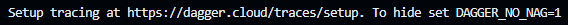

# Getting started with Dagger

The goal is to build components' of CI pipeline for an application called `hello` (allowing you to run `hello <function-name>`) with a Dagger module.

## Init a Dagger module

> [!NOTE]
> If you use a local installation of Dagger, please fork coldelab's repository on your computer:
> ```bash
> git clone https://github.com/<your-github-username>/enter-the-daggerverse.git
> ```

Now, open the folder called `hello`:
```bash
cd hello
```

> [!IMPORTANT]
> All following commands are run in the `hello` folder from your terminal.

Init your Dagger module:
```bash
dagger init --sdk=go --source=./dagger
```

This command will download and run the container image of Dagger engine (based on your CLI version) and generate skeleton of your Dagger module:
- a `dagger.json` file that contains metadata,
- a `dagger` folder:
  - a `main.go` file that will contains your module's code,
  - a `dagger.gen.go` file and a `internal` folder that contains utily code generated by Dagger,

In the `dagger/main.go` file, replace the existing code with the one below:

```go
package main

import (
	"context"
	"dagger/hello/internal/dagger"
	"fmt"
	"math"
	"math/rand/v2"
)

type Hello struct {
}

// Publish the application container after building and testing it on-the-fly
func (m *Hello) Publish(ctx context.Context, source *dagger.Directory) (string, error) {
	return m.Build(source).
		Publish(ctx, fmt.Sprintf("ttl.sh/hello-%.0f", math.Floor(rand.Float64()*10000000))) //#nosec
}

// Build the application container
func (m *Hello) Build(source *dagger.Directory) *dagger.Container {
	build := m.BuildEnv(source).
		WithExec([]string{"go", "build", "-o", "bin/"}).
		Directory("./bin")
	return dag.Container().From("debian:bookworm-slim").
		WithDirectory("/usr/bin/", build).
		WithExposedPort(666).
		WithDefaultArgs([]string{"/usr/bin/hello"})
}

// Build a ready-to-use development environment
func (m *Hello) BuildEnv(source *dagger.Directory) *dagger.Container {
return dag.Container().
	From("golang:1.23-alpine").
	WithDirectory("/src", source).
	WithWorkdir("/src").
	WithEnvVariable("CGO_ENABLED", "0")
}
```

> [!NOTE]
> The module now has 3 functions:
> - `BuildEnv` to build an environnement (Docker image) to be use by another function,
> - `Build` to compile the web application,
> - `Publish` to publish your application's Docker image on `ttl.sh` registry.

> [!NOTE]
> `ttl.sh` is an amazing public Docker repository to store Docker image temporarily. Caution, this repository is public, don't publish any critical images.

> [!WARNING]
> The `dagger.gen.go` has compilation issue.
>
> When we change content of `dagger/main.go` file, public interface changes and the code generation needs to happen again.
>
> We must regenerate the Dagger module's code with command:
> ```bash
> dagger develop
> ```

## Build environment for application's CI's pipeline

> [!NOTE]
> For public methods, the **Go** language uses `PascalCase`. That means, every word that begins with an uppercase letter will be exposed. In our example, we have `BuildEnv` public method.
>
> However, to call `BuildEnv` public method from command line, the name of method is converted by using `kebab-case`. The name will be `build-env`.
>
> Read example bellow.

Now that we have a module, we will run one of its functions:
```bash
dagger call build-env --source=.
```

On the terminal, we will see **interactive** traces.
You can increase verbosity during execution by pressing the `+` key. The more you press, the more verbose the output will be.

> [!NOTE]
> All traces & spans are powered by OpenTelemetry, much like a HTTP request.
> First time viewing the telemetry in the terminal it can be overwhelming. However, the included telemetry is very useful for debugging and understanding the flow of your code and is an incredible tool when using Dagger.

At the end of command execution, you will see this message:


By default, Dagger will try to send traces to Dagger cloud. If you don't want this behavior, you can disable it by setting environment variables called `DAGGER_NO_NAG`:

```bash
export DAGGER_NO_NAG=1
dagger call build-env --source=.
```

Now, the message to setup tracing has disappeared.

Now you have a **Go** execution environment within the source code of your project and checked in alongside your application changes.

## Dagger cloud

During this codelab, we are going to use **Dagger cloud** to help with tracing and debugging.

Please, enable traces by removing the environment variable if you set it:
```bash
unset DAGGER_NO_NAG
```

To see traces, you must create an account (it's free) on [Dagger cloud](https://docs.dagger.io/manuals/user/cloud-get-started).

> [!TIP]
> For this codelab, the easiest way to create an account on **Dagger cloud** is to use `Sign in with GitHub` button.

At login, create an organization named `devoxx`.
A token will be given, export it in you terminal:

```bash
export DAGGER_CLOUD_TOKEN=<token>
```

You can add this to your `.profile` (or anything else) to avoid entering it every time you close and open your shell.

## Interact with the result of your function

When your function returns a container type, you can interact with it to inspect its content.

Run the `build-env` function again with the `terminal` command:
```bash
dagger call build-env --source=. terminal
```

> [!WARNING]
> Use an image with a shell in it (sh, bash, etc)

Check that project's folder is mounted in the container:
```bash
ls -al
```

Type `exit` to leave terminal from container.

At the end of execution, a link to **Dagger cloud** is displayed.
Click on this to explore traces of your command.

## Build application

Now, we have a **Go** environment, we can build the application.

Run command below:
```bash
dagger call build --source=.
```

The application was built and the output/result of the function is a container.

Restart build to interact with the container:
```bash
dagger call build --source=. terminal
```

> [!NOTE]
> But, wait a minute! Where did the `terminal` command come from? I can't find it with `dagger --help`?
>
> It's a good question. You can find it when you read the [User Manual](https://docs.dagger.io/manuals/user/terminal)

Please check that the binary of application is here:
```bash
ls -al /bin/hello
```

Type `exit` to leave container's terminal.

## Test application

Now that the application container is built, run it and test it on our computer!

Start the application with `as-service` Dagger command:
```bash
dagger call build --source=. as-service up --ports=8080:666
```

Click on popup button in VSCode and add `/devoxx` at the end.

> [!NOTE]
> If you don't use codespace, open your internet browser and enter this URL `localhost:8080/devoxx`.

> [!NOTE]
> But, wait a minute! Where did the `as-service` command come from? I can't find it with `dagger --help`?
>
> It's a good question. You can find it when you read the [User Manual](https://docs.dagger.io/api/chaining/#start-containers-as-services)

## Publish application

The last step is to publish our application on the `ttl.sh` registry:
```bash
dagger call publish --source=.
```

Test our published's image (`ID` is the uniq id of image):
```bash
docker run --rm --detach --publish 8080:666 ttl.sh/hello-<ID>
```

In the `PORTS` tab, next to `TERMINAL` tab, add `8080` port.


Click on the associated link, and add `/devoxx` at the end of url.

> [!NOTE]
> If you don't use codespace, open your internet browser and enter this URL `localhost:8080/devoxx`.

Now, you have some reusable functions to build your pipeline with any CI/CD engine (e.g. GitHub Actions, GitLab Runners).

Next, you will use an external Dagger module to reduce the boilerplate in your module. Please go to the next chapter [Use module from Daggervers](03-use-module-from-daggerverse.md).
